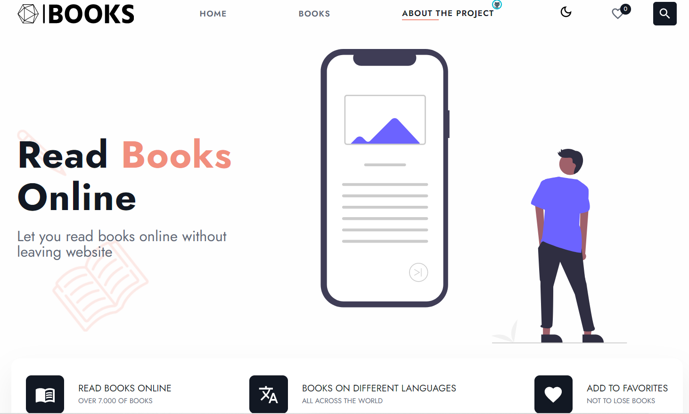
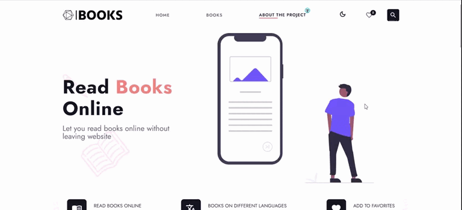

# BOOK-APP

Deploy: [https://your-book-app.netlify.app/](https://your-book-app.netlify.app/ "book-app")

Display books with using[ Gutendex API](https://gutendex.com/ " Gutendex")

## Description:

The site has over 7,000 books in various languages. In the description of books you can find the necessary information (id, author/s of the book, translator, language of the book, genres corresponding books, number of downloads). Below are the recommendations of the books, the same author.

* **Main functions:**

1. Search books by: id, title, author, category;
2. Search books in different languages;
3. Add/Remove Books to Favorites
4. Downloading books or reading online;
5. Change theme (light/dark);

## In this project, I used:

* React
* React-redux
* React-hooks
* React-router
* Redux-thunk
* React-axios
* React-paginate
* Firebase
* Rest API
* Lodash
* **localStorage**
* SASS
* MUI

**Project is constantly updated and new functionality*
