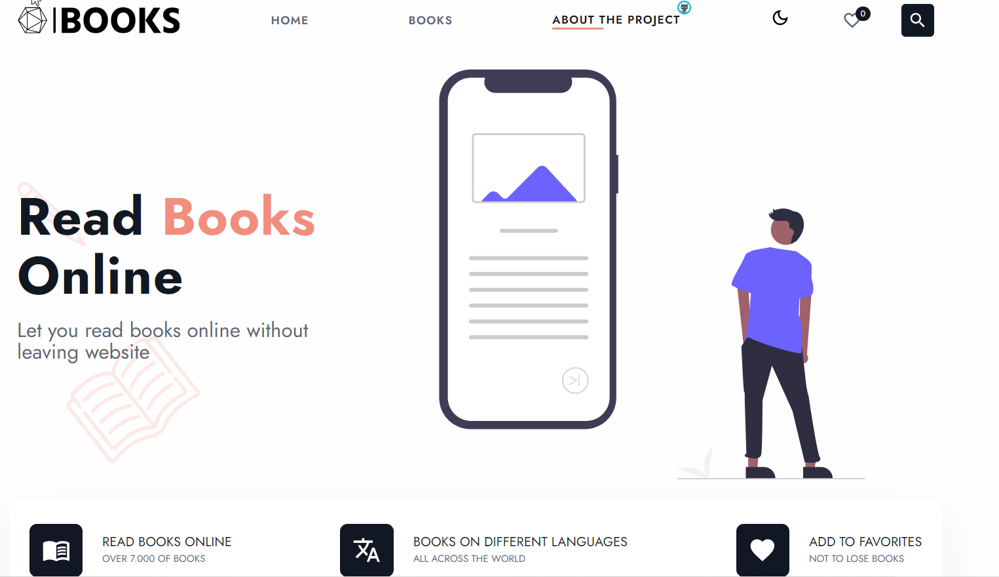

# BOOK-APP

Деплой: [https://your-book-app.netlify.app/](https://your-book-app.netlify.app/ "book-app")

Для получения книг использовался [Gutendex API](https://gutendex.com/ " Gutendex")

## Описание

На сайте представлены более 7000 книг на различных языках. В описании книг можно найти необходимую информацию (id, автора/ов книги, переводчика, язык книги, жанры соответствующие книги, количество скачиваний). Внизу подобраны рекомендации книг, того же автора.

- **Основные функции:**
  1. Поиск книг по: id, названию, автора, категории;
  2. Поиск книг на разных языках;
  3. Добавление/удаление книг в избранные;
  4. Скачивание книг или чтение онлайн;
  5. Смена темы (светлая/темная);

## В этом проекте я использовала:

* React
* React-redux
* React-hooks
* React-router
* Redux-thunk
* React-axios
* React-paginate
* Firebase
* Rest API
* Lodash
* **localStorage**
* SASS
* MUI

**Проект постоянно обновляется и добавляется новый функционал*
